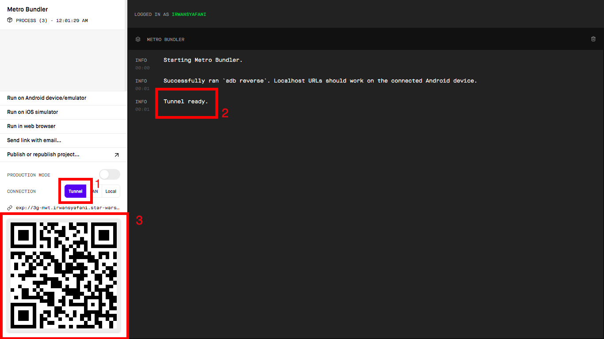
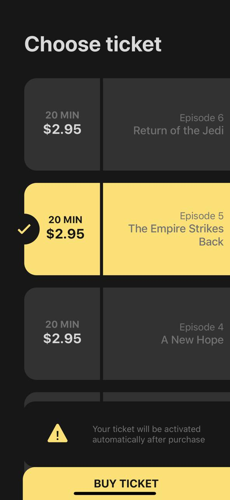
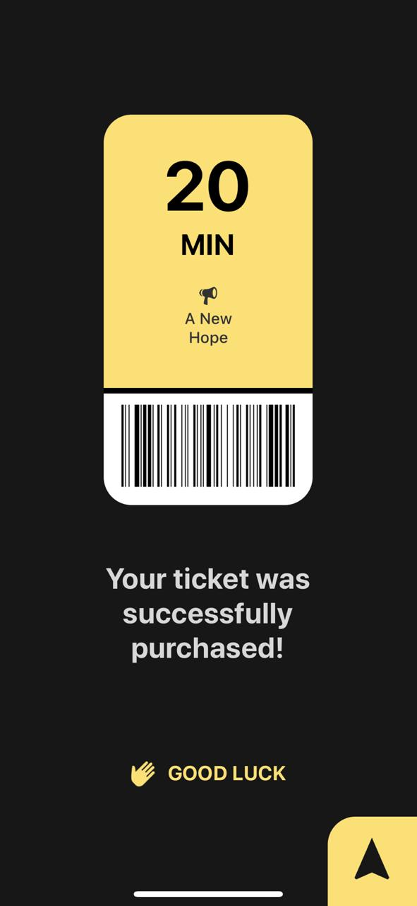

### Question Solution

        - my answer is in folder questions

  

# StarWarsTicket-Client

How To Use This App (Simulator: `iOS`) 
  

`Please read instruction carefully :`

<small>for best experience : use iPhone X or iPhone XR</small>
  

### General Technology includes :

1. expo-cli

2. react-native

3. axios
   

### STEPS

1. 🔓 `clone` this repo
  
2. 📣 run `npm install` or `expo install` in repo on terminal
  

3. 🚀 run `expo start` on terminal

    - <small>you will be redirect to browser tab</small>
  

4. steps : `see picture below`
    
    - `first`, click tunnel button

    - `second`, wait tunnel status until ready

    - `third`, scan QR code with iPhone's camera

  

  
<b>5. 👨🏻‍💻 enjoy the app</b>
  

### App Capture :

    
    
    
    

  

`this project not include .ipa file (for iOS), because apple developer program need paid account, I've tried to register to it but I got rejected several times and I've tried other solution from trying, googling, 'til ask in React Native Group Chat, and I don't get any solution fot it.`
  

`if you knew the solution, please tell me the solution`

`Thanks 😉`

github : @IrwanKhaliq